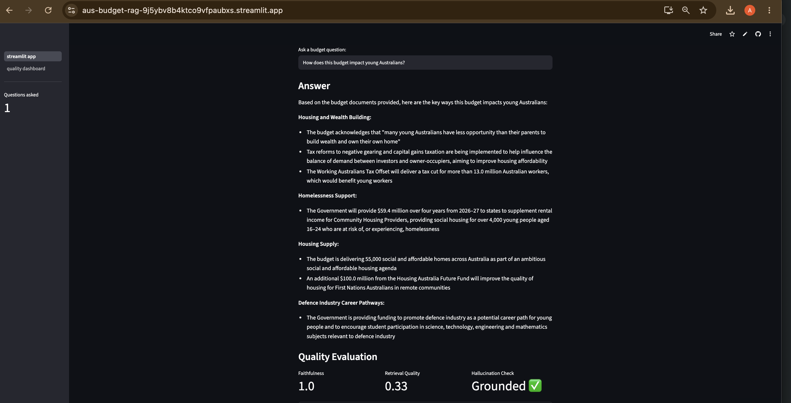
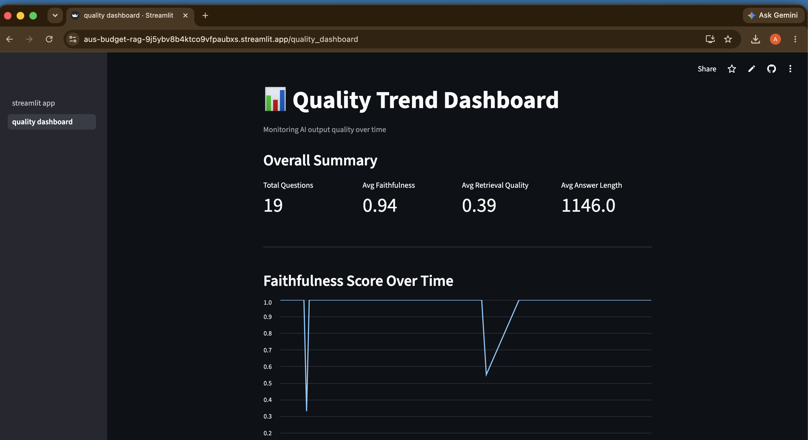

# 🇦🇺 Australian Budget 2026-27 — RAG App with AI Quality Evaluation

A **Retrieval-Augmented Generation (RAG)** application that answers natural language 
questions about the Australian Federal Budget 2026-27, built with a QA-first mindset.

This project demonstrates what happens when **11 years of quality engineering discipline 
meets AI systems** — not just building a RAG app, but building one with a proper 
evaluation framework that tests whether the AI is actually working correctly.

---

## 🚀 Live Demo
**[Try the app here](https://aus-budget-rag-9j5ybv8b4ktco9vfpaubxs.streamlit.app)**

---

## 🎯 What Makes This Different

Most RAG demos just show that the app answers questions. This one also asks:
- Is the answer **faithful** to the source document?
- Did the model **hallucinate** or admit uncertainty appropriately?
- Did the vector store **retrieve the right chunks**?
- Does the answer contain the **expected domain terms**?

That's AI QA — and it's the missing layer in most AI products.

---

## 🏗️ Architecture

```
PDF Documents (Budget Papers 1 & 2)
        ↓
  PDF Loader (LangChain)
        ↓
  Text Chunker (RecursiveCharacterTextSplitter)
        ↓
  Local Embeddings (SentenceTransformers — free, no API cost)
        ↓
  Vector Store (ChromaDB — local)
        ↓
  Retriever (MMR search — top 4 chunks)
        ↓
  LLM (Anthropic Claude Haiku)
        ↓
  Answer + Evaluation Report
```

---

## 📊 Sample Evaluation Results

| Question | Faithfulness | Keyword Coverage | Hallucination Flag |
|---|---|---|---|
| Housing allocation | 1.0 | 1 | Confident answer ✅ |
| Budget deficit projection | 1.0 | 0.67 | Confident answer ✅ |
| Cost of living relief measures | 0.88 | 0.75 | Confident answer ✅ |
| Cryptocurrency (not in doc) | 0.46 | 0.0 | Appropriate uncertainty ✅ |

**Overall average faithfulness (in-scope questions): 0.96**

## 📸 Screenshots




---

## 🧪 Evaluation Framework

Built-in evaluation covers three dimensions:

**1. Faithfulness Score (0–1)**
Measures whether the answer is grounded in retrieved source chunks.
A score of 1.0 means every key term in the answer exists in the source.

**2. Hallucination Detection**
Checks whether the model appropriately expresses uncertainty when
information is not in the document — vs confidently answering from context.

**3. Retrieval Quality Score (0–1)**
Measures whether the vector store retrieved chunks relevant to the question.
Low retrieval quality = the LLM never had a chance to answer correctly.

---

## 🛠️ Tech Stack

| Component | Technology |
|---|---|
| LLM | Anthropic Claude Haiku |
| Orchestration | LangChain (LCEL pipeline) |
| Vector Store | ChromaDB (local) |
| Embeddings | SentenceTransformers all-MiniLM-L6-v2 (local, free) |
| Document Loading | LangChain PyPDFLoader |
| Language | Python 3.14 |
| UI | Streamlit |
| Prompt Testing | Promptfoo |

---

## ⚙️ Setup

```bash
git clone https://github.com/connectashish91/aus-budget-rag
cd aus-budget-rag
python -m venv venv
source venv/bin/activate    # Mac/Linux
pip install -r requirements.txt
```

Create `.env` file:
```
ANTHROPIC_API_KEY=your_key_here
```

Run the app:
```bash
python app.py
```

---

## 📁 Project Structure

```
aus-budget-rag/
├── app.py                      # Main RAG application + evaluation framework
├── streamlit_app.py            # Streamlit UI with evaluation scores
├── pages/
│   └── quality_dashboard.py   # Quality trend + drift detection dashboard
├── promptfooconfig.yaml        # Prompt regression test suite
├── screenshots/
│   ├── main_app.png            # Main Q&A interface with evaluation scores
│   └── quality_dashboard.png  # Quality trend and drift detection dashboard
├── data/                       # Budget PDFs (download from budget.gov.au)
├── requirements.txt
├── .gitignore
└── README.md
```
---

## Prompt Regression Testing
This repo includes a Promptfoo test suite (`promptfooconfig.yaml`) covering:
- Happy path fact retrieval
- Hallucination detection
- Adversarial false premise handling
- Partial context behaviour
- Empty context safety

Run with: `promptfoo eval`

---

## ✅ Completed
- [x] Streamlit UI with live evaluation scores dashboard
- [x] Quality trend logging across sessions
- [x] Drift detection and low quality alerts dashboard
- [x] Prompt regression testing with Promptfoo
- [x] Rate limiting for demo protection
- [x] Deployed to Streamlit Community Cloud

## 🔮 Planned Improvements
- [ ] Conversational memory — multi-turn Q&A with session context
- [ ] LangGraph test case generation agent — auto-generate Gherkin tests from requirements
- [ ] Streamlit UI for Promptfoo results — visualise prompt regression test outcomes
- [ ] Deploy Promptfoo CI pipeline via GitHub Actions


---

## ⚠️ Known Limitations

### Retrieval Quality Metric
The retrieval quality score uses keyword matching between the question 
and retrieved chunks. This has a known blind spot — short or generic 
questions may score 0 even when retrieval is working correctly, because 
meaningful keywords get filtered out by the stopword list or length threshold.

**Fix applied:** Lowered keyword length threshold and expanded stopword 
list to reduce false zero scores. A more robust long-term solution would 
use semantic similarity scoring (e.g. Ragas) rather than keyword matching.

### Non-Determinism
LLM outputs are probabilistic — the same question asked twice may 
produce slightly different answers and evaluation scores. This is 
expected behaviour, not a bug. The quality dashboard tracks score 
trends over time to surface meaningful drift rather than one-off 
variations.

---

## 👤 About

Built by **Ashish Kumar** — Senior Quality Engineer transitioning into AI/ML QA.  
11 years of quality engineering experience applied to AI systems.

[LinkedIn](https://linkedin.com/in/ashish-kumar-654b37158) • [GitHub](https://github.com/connectashish91)
